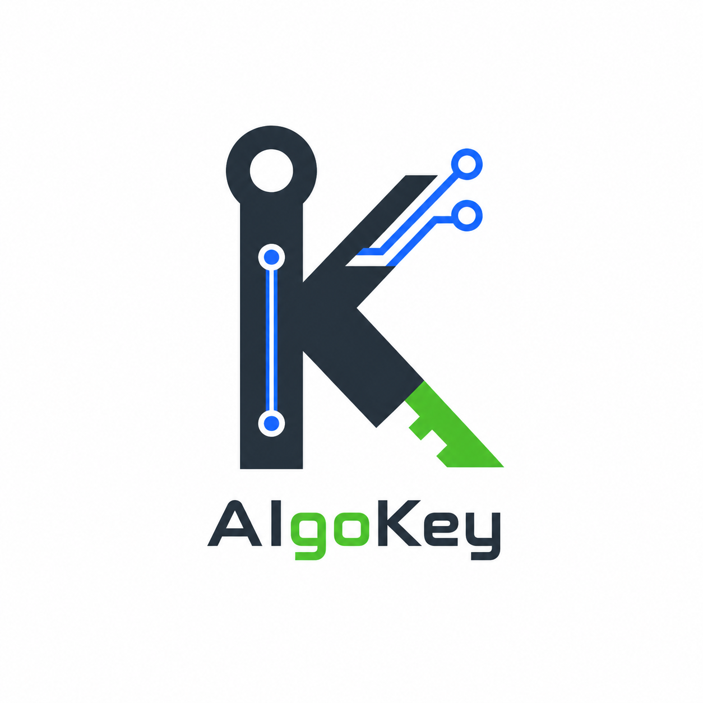

  

<h1 align="center">AigoKey</h1>

  稳定可靠的 AI Token 套餐 — Codex Agent · GPT + Image 系列模型 
  <strong>¥5/天起 · 每天 $30-$200 额度 · 不做 API 按次调用</strong>

  <a href="https://www.aigokey.cn/">🌐 在线预览</a> ·
  <a href="https://www.aigokey.cn/codex-help">📖 帮助文档</a>

---

## ✨ 为什么选择 AigoKey

不用研究 API、不用计算 token、不用频繁充值、不用担心余额忽高忽低。

把 Codex Agent、GPT 系列模型和 Image 系列模型直接用到日常工作里——写方案、改代码、生成图片、做翻译，打开就能用。

## 💰 五档套餐

| 套餐 | 价格 | 每日额度 | 周期总额度 | 适合场景 |
|:---:|:---:|:---:|:---:|---|
| **日卡** | ¥5/天 | $30/天 | — | 当天急用、体验试用 |
| **周卡** | ¥48/周 | $50/天 | $350/周 | 一周项目冲刺 |
| **轻量版** | ¥168/月 | $50/天 | $1,500/月 | 日常办公、轻量使用 |
| **标准版** ⭐ | ¥300/月 | $100/天 | $3,000/月 | 长期高频、固定预算 |
| **专业版** | ¥588/月 | $200/天 | $6,000/月 | 重度创作、密集工作流 |

## 👥 适用人群

AigoKey 覆盖开发、产品、运营、设计、电商、自媒体、外贸、教育、销售、人力行政和数据分析等高频 AI 使用场景。

- **开发者** — 用 Codex Agent 读项目、改代码、跑验证
- **自媒体** — 用 GPT 做选题脚本、用 Image 模型生成封面
- **电商运营** — 商品标题、详情页、客服话术成套产出
- **外贸** — 开发信、客户邮件、报价翻译、产品说明图
- **产品设计** — PRD 梳理、竞品分析、原型 Demo
- **市场营销** — 受众拆解、投放脚本、海报素材
- **教育培训** — 课程大纲、讲义、练习、点评反馈
- **数据分析** — 指标口径、异常解释、分析结论

## Skills 索引

`/skills` 提供按能力类别和职业角色浏览的 Codex Skills 索引。目录数据位于 `src/data/skills.json`，每个条目包含：

- GitHub 来源、安装路径、Stars、Forks、许可证、开放问题和路径可用状态
- 实用性、可靠性、易用性、维护活跃度、文档完整度和安全边界评分
- 上手难度、成熟度、预计配置时间、权限风险、支持平台和所需权限
- 适用职业、任务类型、前置条件、主要产出、编辑评价和使用提示

执行 `npm run update:skills` 可从 GitHub 刷新客观指标、重新计算综合评分，并验证每个目录下的 `SKILL.md`。`.github/workflows/update-skills.yml` 每日自动执行同一流程并提交数据变化。新增 Skill 仍需人工补充分类和编辑字段，避免未经审核的仓库自动进入公开索引。

## 📄 许可

© 2026 AigoKey. 保留所有权利。
