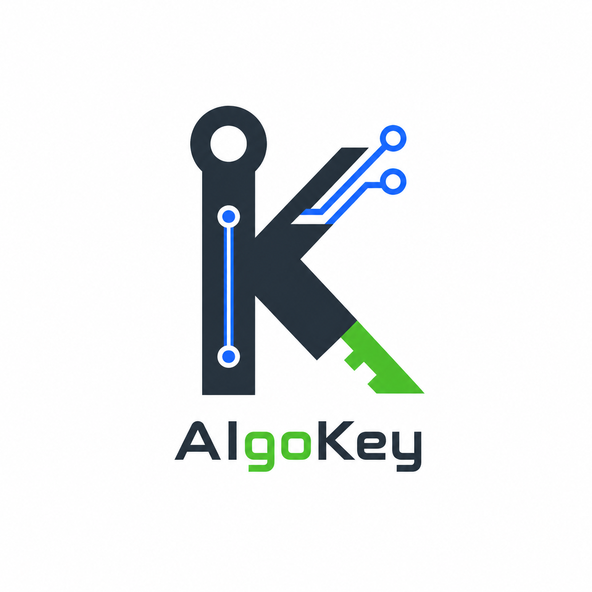

  

<h1 align="center">AIGOKEY</h1>

  稳定可靠的 AI Token 套餐 — Codex Agent · GPT + Image 系列模型 
  <strong>¥5/天起 · 每天 $30-$200 额度 · 不做 API 按次调用</strong>

  <a href="https://www.aigokey.com/">🌐 在线预览</a> ·
  <a href="https://www.aigokey.com/codex-help/">📖 帮助文档</a>

---

## ✨ 为什么选择 AIGOKEY

不用研究 API、不用计算 token、不用频繁充值、不用担心余额忽高忽低。

把 Codex Agent、GPT 系列模型和 Image 系列模型直接用到日常工作里——写方案、改代码、生成图片、做翻译，打开就能用。

## 💰 五档套餐

| 套餐 | 价格 | 每日额度 | 周期总额度 | 适合场景 |
|:---:|:---:|:---:|:---:|---|
| **日卡** | ¥5/天 | $30/天 | — | 当天急用、体验试用 |
| **周卡** | ¥48/周 | $50/天 | $350/周 | 一周项目冲刺 |
| **轻量版** | ¥168/月 | $50/天 | $1,500/月 | 日常办公、轻量使用 |
| **标准版** ⭐ | ¥300/月 | $100/天 | $3,000/月 | 长期高频、固定预算 |
| **专业版** | ¥600/月 | $200/天 | $6,000/月 | 重度创作、密集工作流 |

## 👥 适用人群

AIGOKEY 覆盖开发、产品、运营、设计、电商、自媒体、外贸、教育、销售、人力行政和数据分析等高频 AI 使用场景。

- **开发者** — 用 Codex Agent 读项目、改代码、跑验证
- **自媒体** — 用 GPT 做选题脚本、用 Image 模型生成封面
- **电商运营** — 商品标题、详情页、客服话术成套产出
- **外贸** — 开发信、客户邮件、报价翻译、产品说明图
- **产品设计** — PRD 梳理、竞品分析、原型 Demo
- **市场营销** — 受众拆解、投放脚本、海报素材
- **教育培训** — 课程大纲、讲义、练习、点评反馈
- **数据分析** — 指标口径、异常解释、分析结论

## Skills 索引

`/skills` 提供 100 个来自 GitHub 的精选 Codex Skills，可按能力类别和职业角色浏览。目录数据位于 `src/data/skills.json`，每个条目包含：

- GitHub 来源、安装路径、Stars、Forks、许可证、开放问题和路径可用状态
- 实用性、可靠性、易用性、维护活跃度、文档完整度和安全边界评分
- 上手难度、成熟度、预计配置时间、权限风险、支持平台和所需权限
- 适用职业、任务类型、前置条件、主要产出、编辑评价和使用提示

执行 `npm run update:skills` 可从 GitHub 刷新客观指标、重新计算综合评分，并验证每个目录下的 `SKILL.md`。`.github/workflows/update-skills.yml` 每日自动执行同一流程并提交数据变化。新增 Skill 仍需人工补充分类和编辑字段，避免未经审核的仓库自动进入公开索引。

## Agent 连载更新

`/blog` 是 AIGOKEY 官方 Agent 连载栏目。文章维护在 `src/content/blog/`，每篇文章需要分别提供 `.zh-CN.md` 和 `.en.md` 文件；新增一对文件后，构建会自动生成索引、详情页和相关推荐。

- frontmatter 中的 slug、语言、日期、主题、阅读时长、标题和摘要
- `tags`、`sources` 和至少一个 `visual` 实用视觉块
- 归纳后的长文正文、“今天可以试”的行动建议、失败修正和来源说明
- 中英文文件使用同一个 slug，并保持结构和核心结论一致

栏目会自动提供主题筛选、关键词搜索、独立文章 URL、目录、阅读进度、代码/提示词复制、来源说明和相关文章。内容发布前请运行 `npm run validate:blog`，核对原文，并保留“归纳与实践建议不代表原作者立场”的说明。

## SEO 与域名

- 唯一规范域名为 `https://www.aigokey.com/`，登录与注册使用 `https://llm.aigokey.com/`。
- GitHub Pages 的 Custom domain 必须设置为 `www.aigokey.com`；`.cn`、`.cc` 和其他历史域名应在 DNS/CDN 层永久重定向到 `.com` 对应路径。
- `npm run build` 会为正式页面输出自引用 canonical，并自动生成 `dist/sitemap.xml` 和 `dist/robots.txt`；embed 页面会输出 `noindex,follow` 且不会进入 sitemap。
- 构建结束会自动执行 `npm run validate:seo`，检查每个可索引页面的 canonical、robots、sitemap 是否一致；规范域名可通过 `VITE_SITE_ORIGIN` 覆盖，但生产构建应保持 `.com`。
- 站内页面统一使用带尾斜杠的 URL。历史 `.html` 地址如有外链或索引记录，应在 CDN 层配置到对应目录 URL 的永久重定向。
- `www.aigokey.cn`、裸域和其他历史域名必须在 DNS/CDN 层 301 到 `https://www.aigokey.com` 的同一路径；canonical 只能帮助 Google 选择主版本，不能替代服务器重定向。

## 📄 许可

© 2026 AIGOKEY. 保留所有权利。
